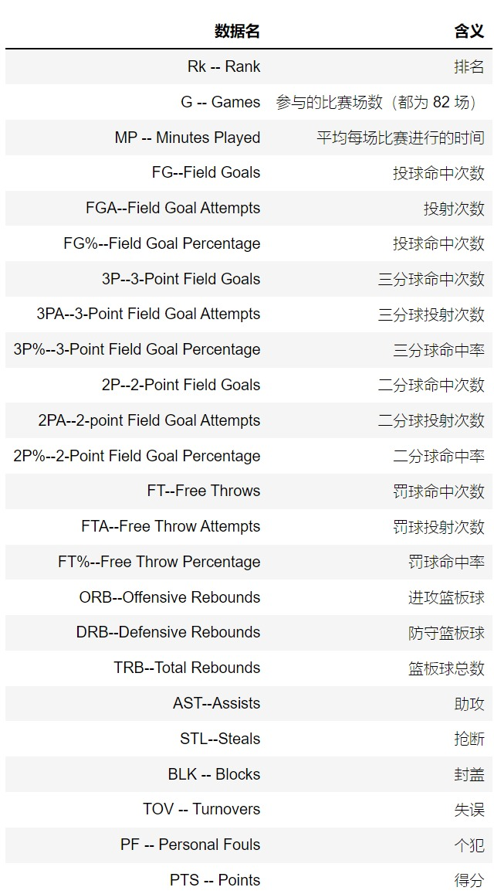
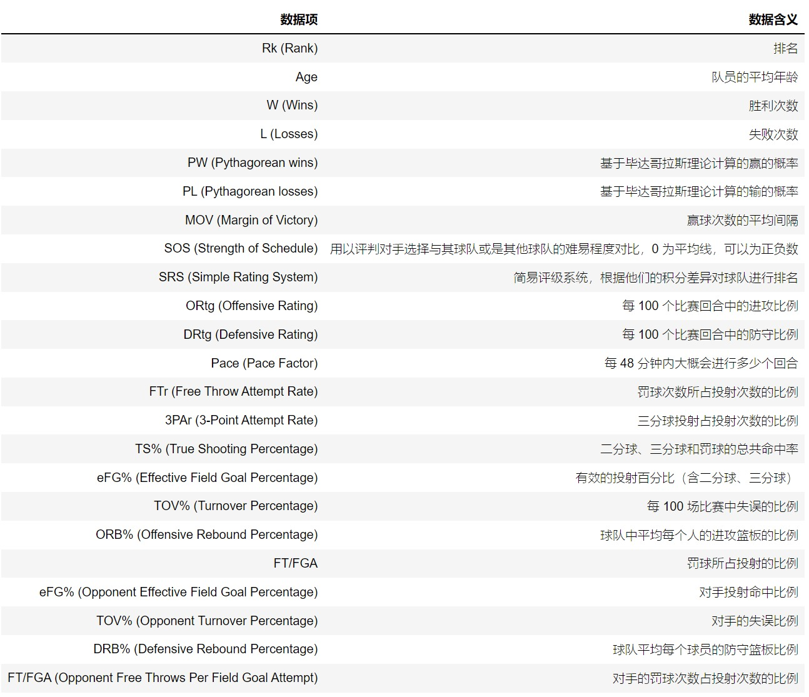
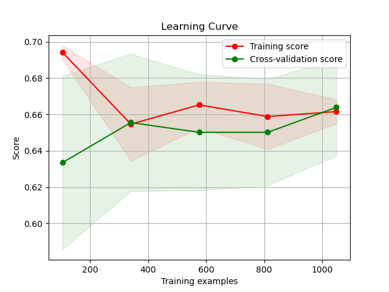
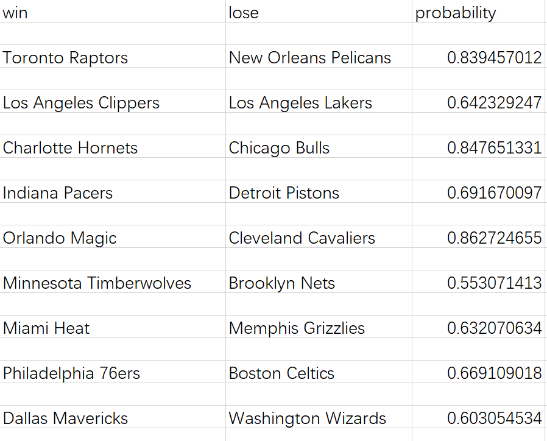

# 机器学习实现NBA比赛预测
## 项目介绍
### 机器学习
机器学习是人工智能的一个子集。这项技术的主要任务是指导计算机从数据中学习，然后利用经验来改善自身的性能。在机器学习中，算法会不断进行训练，从大型数据集中发现模式和相关性，然后根据数据分析结果做出最佳决策和预测。
### NBA比赛结果预测
本次项目的任务是基于往年的 NBA 的各项比赛统计数据，实现针对2021-2022年每场比赛，预测比赛中哪支队伍最终将会获胜，并和真实值进行比较。
## 项目流程分析
* 获取数据、分析数据
* 构建出每场比赛的特征表达，即训练样本
* 建立模型，进行模型训练
* 利用模型进行预测
## 参考数据集
数据来源：https://www.basketball-reference.com/

2018-2019Team Per Game Stats.csv：每支队伍在每场比赛中的表现统计。各字段含义如下：

2018-2019Opponent Per Game Stats.csv：每支队伍在每场比赛中遇到的对手表现统计。各字段含义同上。

2018-2019Miscellaneous Stats.csv：每支队伍的综合统计数据。各字段含义如下：

2018-2019_result.csv：每场比赛的数据。其中包括三个字段：
* WTeam: 比赛胜利队伍
* LTeam: 失败队伍
* WLoc: 胜利队伍一方所在的为主场或是客场

2019-2020_schedule.csv：比赛的安排。其中包括两个字段：
* Vteam: 客场作战队伍
* Hteam: 主场作战队伍

## 特征工程
从得到的数据中选取关键数据建立一个代表比赛的特征向量，由参与比赛的两支队伍的以往比赛情况构成。

为提高预测率，可加入两支队伍各自的Elo等级分作为特征向量的一部分。Elo等级分最初用于国际象棋，现在很多的竞技运动或者游戏中都会采用该制度对选手或玩家进行等级划分。
计算公式如下：
假设 A 和 B 的当前等级分为 $R_{A}$ 和 $R_{B}$，则 A 对 B 的胜率期望值为：

$E_{A}=\frac{1}{1+10^{(R_{B}-R_{A})/400}}$

B 对 A 的胜率期望值为:

$E_{B}=\frac{1}{1+10^{(R_{A}-R_{B})/400}}$

如果棋手 A 在比赛中的真实得分 $S_{A}$​（胜 1 分，和 0.5 分，负 0 分）和他的胜率期望值 $E_{A}$​​不同，则他的等级分要根据以下公式进行调整：

$R_{A}^{new}= R_{A}^{old}+K(S_{A}-R_{A}^{old})$

根据等级分的不同 K 值也会做相应的调整：
* 大于等于2400，K=16
* 2100~2400 分，K=24
* 小于等于2100，K=32

## 模型训练和预测
比赛结果预测是一个典型的二分类问题。机器学习中常见的二分类模型有：逻辑回归、支持向量机、XGBoost、随机森林、人工神经网络等。
选取以上任意一种进行训练。

最终利用训练好的模型在2020-2021年的比赛数据中进行预测。对每一场新的比赛进行胜负方判断，最好能返回胜方胜利的概率。

## 提交&评判
1. 提交内容
   1. 完整的项目文件
   2. 训练过程的学习曲线图 
   
   3. 比赛胜负方预测结果（csv文件）
   
   4. 准确率呈现   例：0.654

2、评判权重
   1. 代码规范（有一定注释） 0.2
   2. 项目完整 0.2
   3. 提交完整 0.2
   4. 特征工程 0.2
   5. 模型选取 0.2

